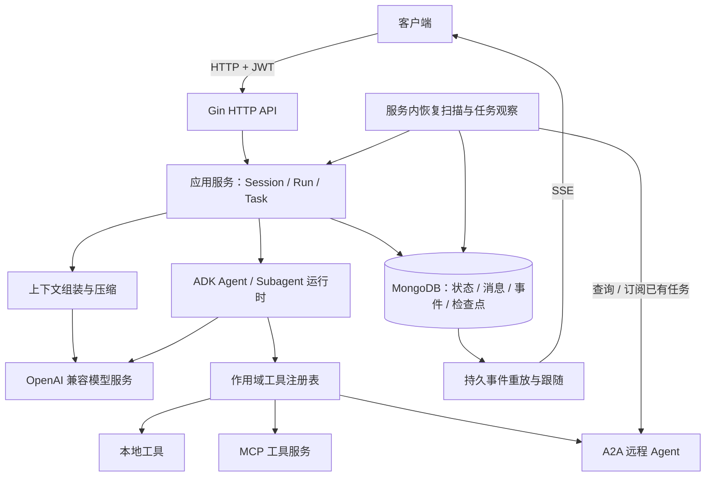

# cagent

cagent 是使用 Go 构建的多租户、多用户 Agent 服务。它通过 HTTP 接收会话和运行请求，通过 SSE 提供持久事件流，使用 MongoDB 保存消息、运行状态、工具任务和恢复检查点。模型执行基于 Google ADK，统一对接 OpenAI 兼容 Chat Completions 接口，支持本地工具、MCP 工具、A2A 远程 Agent 和上下文压缩。

## 核心模块

| 模块 | 职责与能力 |
| --- | --- |
| 会话与身份 | 从 JWT 提取租户和用户作用域，隔离资源；创建会话时选择模型和加权 API key，主对话持续使用同一绑定 |
| Agent 运行 | 管理 Run 生命周期、幂等提交、会话占用、取消，以及 Agent/Subagent 检查点与结果续接 |
| 事件服务 | 消息增量、工具进度和运行终态先持久化，再通过 SSE 重放与跟随，支持跨实例订阅和断点重连 |
| 工具服务 | 按租户和用户注册、发现及授权工具，校验参数和结果，统一接纳即时结果或远端任务句柄 |
| 长任务服务 | 保存已启动任务，持续查询或订阅进度；终态结果原子接纳后恢复原工具调用 |
| 上下文工程 | 按模型窗口计算 Token 预算，生成版本化摘要；保留用户原文、系统约束、工具调用/结果和未完成调用 |
| 持久化与恢复 | MongoDB 事务、版本校验、租约 Fence 和幂等回执；启动扫描未完成运行及未结算任务 |
| 运行保障 | 并发容量控制、日志脱敏与轮转、健康检查、指标、本地有界追踪和优雅关闭 |

MCP 当前支持 HTTP Streamable Transport 的工具发现与普通调用，不支持 MCP tasks。A2A 支持 JSON-RPC 即时结果、长任务观察、取消和暂停交互。服务支持 API 登录生成随机身份 JWT，不提供 A2A 服务端。

## 代码目录结构

```text
cagent/
├── cmd/
│   └── server/                  # HTTP/SSE 与 Agent 服务入口
├── internal/
│   ├── bootstrap/               # 模型和工具加载、依赖装配、监听与关闭
│   ├── transport/httpapi/       # Gin 路由、JWT、DTO、错误映射和 SSE
│   ├── app/                     # 会话、Run、任务、分支、事件与恢复用例
│   ├── agent/                   # 运行时、任务跟踪及恢复边界
│   ├── domain/                  # 领域对象、状态迁移与作用域校验
│   ├── contextengine/           # 上下文组装、预算检查与压缩策略
│   ├── tool/                    # 工具注册、发现、执行与任务能力契约
│   ├── store/                   # 存储请求/结果、事务契约与纯校验
│   ├── storage/schema/          # 集合名称与 BSON 文档结构
│   ├── adapter/
│   │   ├── adk/                 # ADK/OpenAI 模型、工具桥接和检查点
│   │   ├── mongodb/             # 仓储、索引、事务、租约与恢复扫描
│   │   ├── mcp/                 # MCP 官方 SDK 客户端适配
│   │   ├── a2a/                 # A2A 官方 SDK 客户端适配
│   │   └── toolhttp/            # 远端工具 HTTP 连接与安全策略
│   ├── config/                  # 环境配置、模型目录、密钥与集中校验
│   ├── observability/           # 日志、容量闸门、指标与追踪
│   └── apperrors/               # 公共错误分类与原因链
├── docs/                        # 接口、配置、存储、部署与验收文档
├── scripts/acceptance.ps1        # 完整本地验收脚本
├── .env.example                 # 环境配置示例
├── go.mod
└── go.sum
```

测试文件与被测代码放在同一目录。HTTP DTO 和 BSON 文档由适配层定义，领域对象不直接作为外部响应或数据库文档序列化。

## 服务架构设计



### 分层与部署

`cmd/server` 是唯一业务服务进程，内部包含 HTTP、Agent 执行、事件读取、任务观察和恢复扫描。`bootstrap` 负责依赖装配，`httpapi` 负责协议和身份，`app` 协调用例，领域层定义状态规则，适配器连接模型、工具及数据库。密钥轮换通过 server 的 HTTP 运维接口完成。

多个实例可以共享同一 MongoDB。运行通过租约、递增 Fence 和版本校验协调，防止旧实例继续写入；事件从数据库读取，订阅连接无需绑定执行该 Run 的实例。容量上限按实例计算。长任务指工具提供方已经启动的任务，服务跟踪其生命周期，没有独立 Worker 入口或工具执行队列。

### 请求与执行链路

1. HTTP 验证 JWT，将 `tenant_id` 和 `sub` 转换为可信作用域。
2. 创建会话时选择模型文档和加权 API key；提交 Run 时原子保存输入、运行记录、幂等回执及会话占用，返回 `202`。
3. 后台运行获取租约，读取历史与摘要，检查 Token 预算后调用模型。消息和事件持久化后可被 SSE 消费。
4. 工具返回即时结果时继续模型调用；返回任务句柄时保存 Task 和检查点，观察同一远端任务。所有未完成分支均在等待时，Run 状态为 `waiting_tool`。
5. 任务终态结果与检查点、交付状态通过事务接纳，恢复原调用分支；Run 完成、失败或取消时释放会话占用。

同一会话只允许一个活动 Run。HTTP/SSE 断开只结束请求或订阅，后台 Run 继续；主动停止运行应调用取消接口。任务观察超时不等于远端任务失败，Task 取消返回成功也只表示取消意图已持久化。

### 数据与恢复边界

MongoDB 保存 `sessions`、`messages`、`runs`、`events`、`tasks`、`context_snapshots`、`agent_checkpoints`、`task_deliveries`、`run_leases` 和 `mutation_receipts`。业务资源按租户和用户隔离；`models` 是管理员维护的全局模型目录，API key 使用 AES-GCM 加密，AES 密钥由环境注入。

消息在会话内、事件在 Run 内分配递增序号。检查点和交付记录用于恢复原调用及防止重复接纳结果。摘要属于派生数据，原始历史保留。外部调用结果不确定且缺少安全检查点时，运行会明确失败，不盲目重放；服务不保证外部模型或工具副作用恰好一次。

## 使用说明

### 环境要求

- Go 工具链满足 [go.mod](go.mod) 的版本要求，当前声明为 `1.27.1`。
- 可访问的 MongoDB 副本集或支持事务的 mongos；standalone 不受支持，本地也应初始化副本集。
- 可用的 OpenAI 兼容模型端点，以及匹配该模型的 Token 编码、窗口和输出预算。
- 本服务登录接口或可信身份服务签发的 HS256 JWT。

以下示例在仓库根目录使用 PowerShell 执行。

### 配置环境与模型

复制配置示例，编辑 `.env`：

```powershell
Copy-Item .env.example .env
```

最少需要设置以下内容，其余配置可沿用示例中的默认值：

```dotenv
CAGENT_MONGODB_URI=mongodb://localhost:27017/?replicaSet=rs0
CAGENT_MONGODB_DATABASE=cagent
CAGENT_HTTP_ADDRESS=127.0.0.1:8080
CAGENT_HTTP_JWT_SECRET=<至少32字节的随机秘密>
CAGENT_MODEL_ENCRYPTION_KEY_V1=<Base64编码的随机AES密钥>
CAGENT_LOG_PATH=./logs/cagent.log
```

替换占位值，并使 `replicaSet` 与数据库副本集名称一致。AES 密钥支持 16、24 或 32 字节，建议使用随机 32 字节密钥。`server` 自动读取工作目录的 `.env`；优先级为默认值 < `.env` < 已设置的环境变量，显式空值不会回退。

模型名称、API 地址、凭据和 Token 配置来自 MongoDB `models` 集合。部署管理员按 [模型配置](docs/models.md) 中的 AES-GCM 格式准备密文，填写下面文档的 `api_keys` 数组，替换端点、模型名和预算后，使用 MongoDB 管理工具写入 `cagent.models`：

```json
{
  "_id": "example-model",
  "model": "vendor-model-name",
  "provider": "example-provider",
  "base_url": "https://model.example.invalid/v1",
  "api_keys": [
    {
      "id": "STABLE_KEY_ID",
      "version": "v1",
      "ciphertext": "BASE64_CIPHERTEXT",
      "nonce": "BASE64_NONCE",
      "weight": 1
    }
  ],
  "config": {
    "token_encoding": "o200k_base",
    "max_tokens_field": "max_tokens",
    "request_timeout": "2m",
    "window_tokens": 32768,
    "output_tokens": 4096
  }
}
```

此文档只演示结构，地址和模型名是占位值。编码可选 `cl100k_base` 或 `o200k_base`；窗口必须大于输出、工具与安全预留之和。启动时加载模型并校验模型参数，密钥在使用时校验；直接修改 MongoDB 后需重启，通过运维 HTTP 管理模型配置则保存后本实例立即生效。HTTP AES 密钥轮换立即生效并同步写入 `.env`。配置及密钥轮换见 [模型配置](docs/models.md)。

模型管理接口无需认证：`GET /debug/models` 查询目录，`GET /debug/models/:modelID` 查询配置，`PUT /debug/models/:modelID` 新增或完整替换配置，`DELETE /debug/models/:modelID` 删除配置。PUT 支持提交供应商 API key 明文并自动加密，响应不返回明文或密文。`POST /debug/model-keys/rotate` 轮换 AES 加密密钥。模型管理和密钥轮换接口在装配对应依赖后注册。请求示例见 [模型配置 HTTP API](docs/models.md#模型配置-http-api)。

### 启动服务

```powershell
go run ./cmd/server
```

也可以构建后运行：

```powershell
go build -o cagent.exe ./cmd/server
.\cagent.exe
```

在另一终端检查服务：

```powershell
Invoke-RestMethod http://127.0.0.1:8080/healthz
Invoke-RestMethod http://127.0.0.1:8080/readyz
```

`/healthz` 表示 HTTP 存活，`/readyz` 检查 MongoDB primary 可达，不代表外部模型可用。`Ctrl+C` 或 `SIGTERM` 触发撤销就绪、停止 HTTP/SSE、停止应用并释放依赖；未完成运行保留供下次启动扫描恢复。

### 创建会话、提交运行和读取输出

调用 `POST /api/v1/auth/login`，无需鉴权、账号密码或请求体，取响应中的 `token`。每次调用生成随机用户 ID 和租户 ID；请保存并复用原 token 访问同一作用域的资源。配置和调用方式见 [登录与 JWT 签发](docs/http.md#登录与-jwt-签发)。登录 token 仅用于业务 API，模型管理无需认证。

也可由可信签发方使用配置的 JWT secret 签发令牌，包含非空 `sub`、`tenant_id` 和有效 `exp`，例如以下声明结构：

```json
{"sub":"example-user","tenant_id":"example-tenant","exp":2000000000}
```

服务固定验证 HS256 和过期时间，存在 `nbf` 时也验证。将实际令牌放入终端环境变量 `CAGENT_TOKEN`，再执行：

```powershell
$base = 'http://127.0.0.1:8080'
$headers = @{ Authorization = "Bearer $env:CAGENT_TOKEN" }

$session = Invoke-RestMethod -Method Post -Uri "$base/api/v1/sessions" `
  -Headers $headers -ContentType 'application/json' `
  -Body '{"model_id":"example-model"}'

$runHeaders = @{
  Authorization = "Bearer $env:CAGENT_TOKEN"
  'Idempotency-Key' = [guid]::NewGuid().ToString()
}
$body = @{ text = '你好，请介绍你的能力。' } | ConvertTo-Json -Compress
$run = Invoke-RestMethod -Method Post `
  -Uri "$base/api/v1/sessions/$($session.id)/runs" `
  -Headers $runHeaders -ContentType 'application/json' `
  -Body ([System.Text.Encoding]::UTF8.GetBytes($body))

curl.exe -N -H "Authorization: Bearer $env:CAGENT_TOKEN" `
  "$base/api/v1/runs/$($run.id)/events"
```

创建会话返回 `201`，省略 `model_id` 时随机选择模型；提交运行返回 `202` 和 Run ID。同一作用域、会话和幂等键下，相同输入返回原 Run，不同输入返回 `409`；网络重试时应复用原 `$runHeaders` 和请求体。

SSE 的 `id` 是 Run 内事件序号，`event` 是事件类型，`data` 是 JSON 信封，其中内层 `data` 字段为 Base64 编码的原始事件载荷。客户端保存已消费序号，重连时通过 `Last-Event-ID` 发送：

```powershell
curl.exe -N -H "Authorization: Bearer $env:CAGENT_TOKEN" `
  -H 'Last-Event-ID: 12' "$base/api/v1/runs/$($run.id)/events"
```

将 `12` 替换为实际消费位置。心跳是 SSE 注释，不占序号；客户端按序号去重。历史游标已清理时返回 `410`，未来游标返回 `400`。不能仅凭 EOF 判定运行完成，可查询状态；需要停止时再调用取消接口：

```powershell
Invoke-RestMethod -Headers $headers -Uri "$base/api/v1/runs/$($run.id)"
Invoke-RestMethod -Method Post -Headers $headers `
  -Uri "$base/api/v1/runs/$($run.id)/cancel"
```

Run 状态为 `queued`、`running`、`waiting_tool`、`completed`、`failed` 或 `cancelled`。浏览器客户端应使用支持 Authorization 头的流式读取方式。

### HTTP 接口速查

登录接口无需鉴权；其他业务接口均要求 `Authorization: Bearer <JWT>`，资源不存在或无权限统一返回 `404`。

| 方法 | 路径 | 用途 |
| --- | --- | --- |
| POST | `/api/v1/sessions` | 创建会话，可指定 `model_id` |
| GET | `/api/v1/sessions/:sessionID` | 查询会话 |
| POST | `/api/v1/sessions/:sessionID/runs` | 提交文本输入 `{"text":"..."}` |
| GET | `/api/v1/runs/:runID` | 查询运行状态 |
| POST | `/api/v1/runs/:runID/cancel` | 取消运行，成功返回 `204` |
| GET | `/api/v1/runs/:runID/events` | SSE 重放与跟随 |
| GET | `/api/v1/tasks/:taskID` | 查询本地持久任务、进度和结果 |
| POST | `/api/v1/tasks/:taskID/cancel` | 保存任务取消意图，返回 `202` |
| POST | `/api/v1/tasks/:taskID/input` | 为暂停任务补充 `{"text":"..."}` |
| POST | `/api/v1/tasks/:taskID/authorization` | 使用已配置的 `credential_ref` 续接授权 |

错误响应为 `{"error":{"code":"...","request_id":"..."}}`。运行或 SSE 容量满载时返回 `503`、`overloaded` 和 `Retry-After: 1`。完整 DTO、错误码与事件格式见 [HTTP 接口](docs/http.md)。

### 启用工具与长任务

在 `.env` 中设置可信工具清单路径：

```dotenv
CAGENT_TOOLS_FILE=./docs/tools.example.json
```

[示例清单](docs/tools.example.json) 为 `example-tenant/example-user` 注册本地 `echo` 工具；使用其他身份时需修改清单中的 `tenant_id/user_id`。远端 MCP/A2A 连接需要配置协议、可信 URL、工具白名单及环境凭据引用。清单在启动时加载，修改后需重启。

长任务交接时，从 `tool.waiting` 或 `tool.progress` 事件载荷读取本地 `task_id`，再使用 Task API 查询、取消或补充输入。授权接口请求形如 `{"text":"继续","credential_ref":"secondary"}`，引用必须由管理员预先配置。任务完成后，服务将结果交还原 Agent/Subagent 继续生成；Run 取消后迟到结果仍可保存，但不会继续生成。详见 [工具说明](docs/tools.md) 与 [长任务与恢复](docs/tasks.md)。

### 日志与运维

默认日志级别为 `info`，文本日志写入 `/app/logs/cagent.log`，单文件 50 MiB，保留 3 个压缩备份；本地可使用前述 `./logs/cagent.log`。通过 `CAGENT_LOG_LEVEL/PATH/SIZE/ROLL` 调整。

默认单实例上限为 64 个 Run、16 个模型请求、32 个任务观察请求和 256 个 SSE 订阅，等待工具的 Run 也占运行容量。默认启用 `/debug/metrics` 和 `/debug/traces`，无需认证。追踪仅保留本实例最近 256 条已结束 span。详见 [运行保障](docs/operations.md)。

## 开发检查

```powershell
go test ./...
go vet ./...
go build ./...
```

真实数据库集成测试需要设置 `CAGENT_TEST_MONGOD` 为本机 `mongod` 路径，或设置 `CAGENT_TEST_MONGODB_URI` 为专用测试副本集 URI；未配置时相关测试会跳过。完整验收脚本使用临时 MongoDB 实例：

```powershell
$env:CAGENT_TEST_MONGOD = 'C:\path\to\mongod.exe'
.\scripts\acceptance.ps1
```

脚本执行全量测试、关键包 race、vet 和 build；race 需要可用的 CGO/C 编译器。外部模型、工具提供方及生产多节点故障需在实际环境另行验证，详见 [整体验收](docs/acceptance.md)。

## 参考文档

- [配置约定](docs/configuration.md) · [模型配置与密钥轮换](docs/models.md)
- [HTTP 与 SSE](docs/http.md) · [工具配置](docs/tools.md) · [长任务与恢复](docs/tasks.md)
- [应用服务与事件流](docs/application.md) · [上下文工程](docs/context.md) · [ADK 模型执行](docs/adk.md)
- [存储契约](docs/storage-contracts.md) · [MongoDB 适配](docs/mongodb.md) · [存储结构](internal/storage/schema/README.md)
- [日志约定](docs/logging.md) · [运行保障](docs/operations.md) · [部署交付](docs/deployment.md) · [整体验收](docs/acceptance.md)
