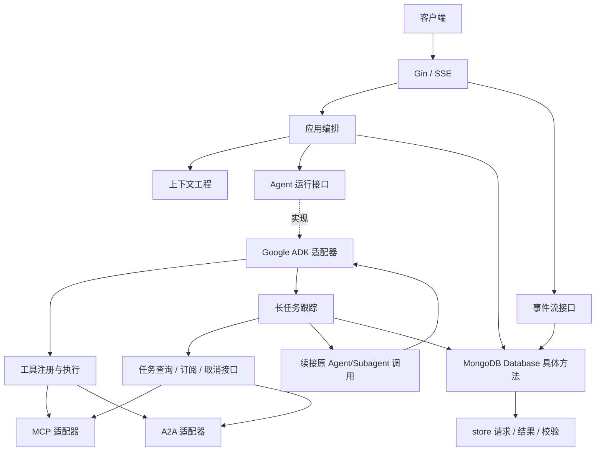

# 架构设计

## 范围与依赖方向

当前已完成 P1 公共组件、P2 存储契约及 P3 MongoDB 适配器，包含事务、租约、幂等回执、序号分页、检查点和交付记录的真实持久化。MongoDB 8.0.32 单节点副本集集成验证已通过。P4 应用服务、服务内运行生命周期和持久事件流已实现；P5 上下文组装、P6 ADK/OpenAI、P7 Gin/JWT/HTTP/SSE 与启动装配均已通过本地验收。P8 工具注册、本地/MCP/A2A 协议适配、ADK 工具循环、任务交接和暂停交互已实现并验证。P9 任务持续跟踪、精确续接和恢复扫描、P10.1 上下文压缩及 P10.2 容量与观测已实现。P10.3 补齐端到端重启续接/SSE 重放、提交断连故障测试和交付脚本，见 [整体验收](acceptance.md) 与 [部署交付](deployment.md)。外部模型/工具及生产拓扑验收仍待环境配置，项目未全部验收完成。

### 已实现：P8 工具边界与协议适配

`tool.Catalog` 是构造后不可变的授权快照；List/Resolve/Execute/任务操作都校验有效作用域，解析出的执行器绑定到当时的 Scope，使用 JSON Schema、上下文超时和字节限制校验边界。远端连接从 MongoDB `tool_connections` 读取，保留完整 Scope 授权、工具白名单及每连接凭据环境引用；本地工具自动全量扫描 `local-tools`，对所有有效 Scope 可见，业务配置来自各自的 `tool.json.config`。URL 不来自模型或 HTTP 输入，禁止重定向和自动重试。超限结果默认拒绝，可显式注入按 Scope 保存的 ArtifactWriter；没有默认 artifact 存储服务。

MCP 使用官方 modelcontextprotocol/go-sdk v1.8.0，固定 2025-11-25 Streamable HTTP，支持握手、分页发现与普通调用。SDK 没有 tasks API，MCP Get/Follow/Cancel 明确返回 Unsupported，旧任务不重执行。A2A 使用官方 a2aproject/a2a-go v0.3.15，固定 0.3.0 JSON-RPC，支持 Card、即时 Message/Task、查询/取消/订阅及暂停补充消息。订阅通知触发完整查询，保留 contextId；SDK 不暴露 SSE ID，非空旧游标明确拒绝。HTTP 安全策略位于 toolhttp，协议客户端与编解码均由 SDK 提供。详见 [工具说明](tools.md)。

TaskClient 的观察参数从 Scope 扩展为原 ToolCall，结果可按原 CallID 关联；调用方必须先按认证 Scope 读取持久 Task。新增 TaskInteractor，JWT 路由 `/tasks/:taskID/input` 和 `/tasks/:taskID/authorization` 仅引用本地任务 ID，后者只接受可信凭据引用。应用拒绝终态 Run，确认远端暂停后补充原任务；202 不表示终态或本地恢复。

ADK 工具定义随每轮模型请求发送，不计算 Token 预算；有工具声明时使用完整非流式 Chat Completions，避免未完整参数触发执行。即时调用/结果以 assistant/tool 角色成对持久化；任务句柄触发真实 SDK 暂停检查点，经 Update.Tasks 和当前 Fence 下的 TrackTask 事务交接。ErrWaiting 保留 Run waiting_tool 与会话占用，不提交 completed。多任务逐个登记，SDK 检查点 Data 保留整批句柄，P9 已从整批持久句柄补齐部分登记，不重执行工具。

P9 已接入持续观察、生产 Runtime.Resume、TaskDelivery 原子消费与启动恢复扫描。真实 ADK、本地 MCP/A2A HTTP/SSE 提供方及 MongoDB 双任务持久化已验证，外部提供方未配置。

### 已实现：领域身份与关联校验

`internal/domain/validation.go` 与 `tool_validation.go` 提供无副作用的值接收者方法。校验返回首个错误，统一为 `apperrors.ErrInvalidArgument`，包含结构化字段路径及安全说明，不回显用户输入。

| 入口 | 用途 |
| --- | --- |
| `Scope.Validate` / `ValidateAgainst` | 拒绝缺失或纯空白的租户/用户，验证两个有效作用域完全一致 |
| 资源的 `Validate` | 验证 Session、Run、Message、Event、ContextSnapshot 的身份和必要引用 |
| `ValidateForSession` | 验证 Run、Message、ContextSnapshot 属于指定会话 |
| `ValidateForRun` | 验证 Message、Event、ToolCall、Task 属于指定运行，存在会话字段时同时验证会话关联 |
| `AgentExecution.Validate` | 验证 Agent 与调用 ID，允许根调用省略父 ID，拒绝空白父 ID 和自引用 |
| `ToolCall.Validate` / `TaskHandle.Validate` | 验证工具调用路由、支持的协议以及任务的连接引用和远端 ID |
| `ToolResult.ValidateForCall` / `TaskHandle.ValidateForCall` | 验证结果的 CallID 或句柄协议与原调用一致 |
| `ToolOutcome.Validate` / `ValidateForCall` | 强制 Result 与 Task 恰好存在一个，并验证其结构和调用关联 |
| `Task.Validate` | 验证任务与嵌套调用的作用域、句柄协议、可选结果的 CallID 一致 |

后续应用、存储及工具边界应显式调用这些方法；Go 结构体赋值不会自动触发校验。Scope 必须来自可信身份，数据库读写仍须携带 Scope 条件。内存中的关联检查不能证明引用存在，也不替代工具授权。

本阶段只验证身份及关联：不检查状态迁移、版本、时间、消息内容、Token 数或序号分配。Message.RunID 在会话历史校验中可为空，在 `ValidateForRun` 中必须匹配指定运行。幂等键可选；工具参数保持协议无关，不在领域层猜测其编码。任务句柄的 ConnectionID 对所有协议均必填，包括支持长任务的本地工具；ContextID 可选。所有标识保持原值，仅拒绝纯空白，不进行隐式 trim。

行为测试覆盖缺失字段、跨用户/租户关联、错误会话/运行引用、工具结果互斥、未知协议、任务嵌套关联和不泄露字段值的错误信息。

### 已实现：领域状态规则

`status.go` 提供 RunStatus/TaskStatus 的 Validate、IsTerminal、ValidateTransition，以及 TaskStatus.IsPaused。既有 Run.Validate/Task.Validate 仍只验证身份与关联，创建/持久化边界须另行验证 Status；零值不隐式视为初始状态。未知状态返回 `ErrInvalidArgument`，两个合法状态之间的禁止迁移返回 `ErrConflict`。错误字段为 `run.status` / `task.status`，不包含原始提供方值。

以下迁移表省略各状态到自身的合法无变化迁移；终态不允许迁移到其他状态。

| 对象 | 当前状态 | 允许的新状态 |
| --- | --- | --- |
| Run | queued | running、failed、cancelled |
| Run | running | waiting_tool、completed、failed、cancelled |
| Run | waiting_tool | running、completed、failed、cancelled |
| Run | completed / failed / cancelled | 无 |
| Task | submitted | running、input_required、auth_required、succeeded、failed、cancelled、rejected |
| Task | running | input_required、auth_required、succeeded、failed、cancelled、rejected |
| Task | input_required | running、auth_required、succeeded、failed、cancelled、rejected |
| Task | auth_required | running、input_required、succeeded、failed、cancelled、rejected |
| Task | succeeded / failed / cancelled / rejected | 无 |

Task 允许跳过未观察到的中间状态，不要求先观察 running 才接收终态。两种 required 状态是可恢复暂停，继续原任务，不重新执行工具。Run 的 waiting_tool 由后续运行时按所有分支聚合；领域迁移表不能判断分支是否均在等待。RunCancelled 表示本地运行停止生成，远端任务仍可保存实际成功等迟到结果，不自动恢复已取消 Run。

`task_state.go` 提供以下内存状态操作，返回 `(changed, error)`：

- `RequestCancel(at)` 只记录首次 CancelRequestedAt；重复请求或终态后请求是无变化操作。提供方接受请求、不支持取消或本地观察超时均不构成远端取消确认。
- `RecordObservationError(message, at)` 仅改变安全说明及 UpdatedAt，保留最后成功观察时间及远端状态；重复说明与终态后的迟到观察错误无变化。安全说明由调用方提供，原始错误、未知状态诊断留在适配层。重试只能恢复查询/订阅。
- `ApplyUpdate(update, at)` 接收完整快照，空字段表示清空，不是局部补丁；检查状态迁移、终态结果限制及 CallID 关联后一次性应用，失败不修改对象。结果中的 Error 不用于推断状态。进度、结果及嵌套 Data 深拷贝，避免外部缓冲区修改已接收内容。

相同状态可以更新活动任务的进度和不透明游标；完全相同快照不更新时间。第一次成功观察、观察错误后的恢复也算变化，成功时清除 ObservationError。LastObservedAt 记录最近一次有变化的成功观察，不是每次轮询的心跳。快照相等采用 Go 结构相等语义，nil 与空切片不同。记录变化时必须传入非零时间，但不按本地时间或游标字符串排序；活动通知的乱序协调由适配器通过协议能力/查询快照解决。

终态确认后冻结状态、结果、进度、游标；完全相同快照幂等，任何不同快照报冲突（内容冲突字段 `task.update`）。终态允许没有 Result，但不允许随后补写；适配器须在首次提交终态前完成所需结果组装。该冻结不妨碍后续持久化流程原子写入消费标记 AppliedAt。

这些操作不自增 Version、不更新 AppliedAt、不访问外部系统；调用方使用独占内存副本。Go 公开字段赋值不会自动执行规则，数据库保存仍需版本比较，冲突后重新加载状态再决策。检查点/结果消费协调、多实例一致性在 P2/P3/P9 实现。行为测试覆盖完整迁移矩阵、暂停恢复、终态保护、取消竞争、观察失败、重复更新及失败原子性。

### 已实现：公共错误约定

`internal/apperrors` 仅依赖标准库，可由 domain、store、应用及适配器直接引用，避免 domain 反向依赖 store。稳定类别使用实现了 error 的 Kind 常量：

| 类别 | 标识 | 语义 |
| --- | --- | --- |
| `ErrInvalidArgument` | `invalid_argument` | 必填缺失、非法值、关联不一致；包含未知工具协议 |
| `ErrNotFound` | `not_found` | 在授权作用域内找不到资源 |
| `ErrConflict` | `conflict` | 版本或其他并发约束冲突，不自动决定是否重试 |
| `ErrUnsupported` | `unsupported` | 合法请求所需能力不被支持，例如提供方不能取消任务 |
| `ErrOverloaded` | `overloaded` | 本实例容量已满；HTTP 返回 503 与 Retry-After，不自动重放外部副作用 |

`New(kind, field, message)` 创建公共错误；`Wrap(kind, field, message, cause)` 保留底层原因，cause 为 nil 时返回 nil。`errors.Is` 可穿透标准 `%w` 包装识别类别、原始哨兵及标准 context 取消/超时；`errors.As` 可提取 `*apperrors.Error` 的 Kind、Field、Message，也可提取原因链中的提供方错误类型。多层公共错误可能匹配多个类别，需要当前边界分类时读取最外层 Error.Kind。不会将取消/超时转换成新的公共类别，也不会推断远端任务终态。

字段路径及安全说明必须由调用边界提供可信静态文本，不能拼入用户输入、凭据、提示词或连接 URL。本包的 Error() 和 fmt 格式化（含 `%+v`、`%#v`）只展示安全内容，不展开底层原因；它不是任意文本的自动脱敏器。Unwrap/As 提取的底层诊断仍可能含秘密，不得直接输出到客户端或未经脱敏的日志。传输层应显式选取公共字段构造 DTO，不序列化完整错误链；HTTP 状态码、SDK 映射和日志策略属于后续适配层。

领域校验保留 P1.1 的字段路径和首错行为；`fmt.Errorf("session: %w", err)` 等外层引用说明不改写结构化 Field。`store.ErrNotFound` 与 `store.ErrConflict` 保留为公共类别的常量别名，旧名称与新类别的判断双向兼容；展示文案不属于兼容契约。

行为测试覆盖四类错误、多层包装、结构化详情、原因身份与类型、空原因、标准取消/超时、敏感诊断隔离、领域校验迁移和存储别名兼容。

### 已实现：配置加载与校验

`internal/config` 提供 `Defaults()`、`Load()`、可注入环境快照的 `LoadFromEnv()` 和 `Config.Validate()`。加载顺序为默认值 → 已设置的 `CAGENT_*` 环境变量 → 类型解析 → 集中校验；未设置保留默认值，显式空值不能触发回退。任何失败返回零值 Config，错误归为 `apperrors.ErrInvalidArgument`，携带稳定配置路径，不回显输入或保留包含输入的解析错误原因。

Logging、HTTP、MongoDB、Agent、Tasks、Context 的进程配置由环境变量加载，模型文档从 MongoDB 读取。校验日志级别/路径/轮转参数、监听地址、必填字段、正时间间隔和历史保留轮数；不计算 Token 预算。实际连接与提供方接口支持在运行时验证。

配置是进程启动时取得的独立快照，不存储请求身份；配置包不读取文件、连接网络或输出日志。server 入口先通过 joho/godotenv 自动加载当前工作目录的 `.env`，已有环境变量优先。完整 Config 及 URI 可能包含凭据，不得整体记录。缓冲、租约、认证等选项在对应模块明确实际需求后增加；现有入口已加载完整配置，追加 HTTP.ValidateServer 验证 JWT 和传输限制。完整键表、优先级和示例见 [配置约定](configuration.md) 与 [配置示例](../.env.example)。

### 已实现：Logrus 日志

使用 Logrus v1.10.2 默认实例及 Lumberjack v2.2.1 文件轮转。Init 在业务 goroutine 启动前配置级别、路径、大小与备份数量，固定无颜色文本格式；默认 info、50 MiB、3 个压缩备份。验证失败不改变全局配置，Init 不探测文件权限，首次写入时才打开文件。

业务直接调用 logrus.Info/WithFields/WithError，无需创建或传递 logger。在输出位置显式添加 request_id/session_id/run_id/task_id/invocation_id；不再维护 WithCorrelation 或从 context 自动提取 ID。全局实例不保存当前请求或用户，各 goroutine 使用独立字段映射。

P10.2 已补齐日志敏感字段处理：formatter 只保留固定关联/操作字段，丢弃未知字段，错误只输出稳定类别；Message 必须为代码固定文本。公共错误的原因链仍仅供内部程序处理。详见 [日志约定](logging.md)。

入口记录实际启动和退出，并显式携带 process_id；配置无效时向 stderr 报错并返回 1。正常退出调用 Close 关闭当前日志文件；业务须先停止日志写入，Close 不等待后台压缩。P7 已实现真实服务就绪与优雅关闭，P10.2 已接入指标与有界本地追踪。
采用模块化单体，由同一服务承载 HTTP 和 Agent 运行时。异步任务指 Agent/Subagent 调用工具后返回的持续执行任务，例如类似 A2A Task 的任务句柄。实际工作由工具提供方执行，本服务负责识别、跟踪、持久化和续接调用，不设置独立 Worker 或工具执行队列。



`domain` 不依赖 SDK；存储调用方直接依赖 `*mongodb.Database` 并调用具体方法，`store` 仅保留请求、结果和纯校验，不定义仓储接口或泛型 CRUD。其他运行/协议能力仍使用现有接口。`cmd/server` 通过 bootstrap 组合具体实现，HTTP handler 不直接查询 MongoDB 或调用 ADK。图中节点表示逻辑职责；MongoDB、App/Events、ADK/OpenAI 及 P8 工具协议已实现，本地验收已通过。TaskTracker 自动观察/续接和外部提供方验收仍待后续。

## 模块与目录

```text
cmd/
  server/main.go           # 唯一进程入口，加载配置、日志及完整 bootstrap
internal/
  app/
    service.go             # 会话与 Run 用例契约
    application.go         # 应用服务、运行生命周期、续租、取消与恢复接入
    events.go              # EventStream：持久化事件发布、重放与订阅
  agent/
    runtime.go             # Runtime：Agent/Subagent 执行与续接
    tasks.go               # TaskTracker：已有工具长任务的生命周期
  contextengine/          # 已实现上下文组装/用量触发摘要；保留 P10 压缩契约
  tool/registry.go         # 工具发现、执行及提供方 TaskClient
  tool/catalog.go          # 不可变 Scope 注册、Schema/超时/输出边界
  domain/                 # 与 SDK 无关的共享领域类型
  apperrors/              # 公共错误类别、安全详情及原因链
  store/                  # 请求、结果与纯校验，无仓储接口
  adapter/mongodb/        # 已实现：仓储、索引、事务、租约、恢复管理
  adapter/adk/            # 模型、工具桥接及 SDK 检查点
  adapter/mcp/            # MCP 2025-11-25 Streamable HTTP
  adapter/a2a/            # A2A 0.3.0 JSON-RPC 客户端
  adapter/toolhttp/       # SDK 共用 HTTP 安全策略（无协议实现）
  config/                 # 默认值、环境加载、类型解析与集中校验
  observability/          # 容量闸门、指标、本地追踪、日志脱敏与轮转
docs/architecture.md
```

长任务跟踪归属 `agent`，它服务于 Agent/Subagent 的暂停和续接；`tool.TaskClient` 仅负责提供方协议操作。事件流归属 `app`，负责运行输出持久化与订阅，HTTP 层只负责 SSE 编码。`store` 保持独立，避免协议适配器承担存储职责。

以下为适配层目录与职责（P7 HTTP/bootstrap 与 P8 MCP/A2A 已实现）：

| 计划目录 | 职责与实现边界 |
| --- | --- |
| `internal/transport/httpapi` | Gin 路由、身份作用域、DTO、SSE 编码；依赖 app 和 agent 的应用接口 |
| `internal/adapter/adk` | 实现 agent.Runtime，桥接上下文、工具与 TaskTracker |
| `internal/adapter/mcp`、`internal/adapter/a2a` | 实现 tool 的发现/执行及 TaskClient 协议能力 |
| `internal/bootstrap` | 配置加载、依赖装配和优雅关闭；由 cmd/server 调用 |

## 多用户与并发

- 认证中间件从可信身份生成 `Scope{TenantID, UserID}`，资源 ID 不代表访问授权。单租户部署也使用服务端指定的固定 TenantID。
- 会话、消息、运行、事件、任务及快照的读写都包含 Scope；嵌套的工具调用作用域必须与任务一致。缺失作用域应拒绝，禁止通过空 Scope 实现全量查询。
- SDK 客户端可在确认并发安全后共享；会话状态、工具凭据、请求上下文和压缩缓存必须隔离。不能在全局 Agent 对象中保存当前用户。
- 不同用户/会话并发执行；同一会话初期限定一个活动 Run，由 MongoDB 原子占用/租约保证。进程内 mutex 无法保证多实例隔离。
- `Version` 支持乐观锁。旧独立 Append/Save 写入口已移除；Database 的运行/任务事务方法 将会话版本检查、序列分配及关联写入置于同一事务，写入还须携带当前租约 Fence。
- 长任务继承原工具调用的 Scope，持久化 RunID、AgentID、InvocationID、ParentInvocationID 和 ToolCall ID。并行 Subagent 的任务结果必须精确路由到各自调用，不能只按 Agent 名称匹配。

## 运行与 SSE

1. 创建会话，提交用户输入和幂等键；应用层持久化 Run 与输入，返回 Run ID。
2. 运行执行器读取历史，准备上下文并调用 ADK；运行生命周期独立于 HTTP 请求。
3. 将 ADK 输出转换为领域事件，持久化后对订阅者可见。运行输出采用 `agent.Update`，由持久化事件层分配序号。
4. 客户端通过独立 GET SSE 连接读取已有事件并继续订阅新事件。SSE 的 `id` 使用 Run 内 Sequence，`event` 使用 EventKind，`data` 使用 JSON。
5. `Last-Event-ID` 表示已消费序号，重连读取其后的事件；允许重放重复，客户端按序号去重。历史追赶与实时订阅切换必须保证无缺口。

路由（会话/Run/SSE/Task 均已注册）：

| 方法 | 路径 | 用途 |
| --- | --- | --- |
| POST | `/api/v1/sessions` | 创建会话 |
| GET | `/api/v1/sessions/:sessionID` | 查询会话 |
| POST | `/api/v1/sessions/:sessionID/runs` | 提交运行，返回 202 和 Run ID |
| GET | `/api/v1/runs/:runID` | 查询运行状态 |
| GET | `/api/v1/runs/:runID/events` | SSE 订阅与重放 |
| POST | `/api/v1/runs/:runID/cancel` | 请求取消运行 |
| GET | `/api/v1/tasks/:taskID` | 查询工具长任务及最新进度 |
| POST | `/api/v1/tasks/:taskID/cancel` | 请求取消任务 |
| POST | `/api/v1/tasks/:taskID/input` | P8 已实现：补充原暂停任务输入 |
| POST | `/api/v1/tasks/:taskID/authorization` | P8 已实现：使用可信凭据引用继续原暂停任务 |

心跳为 SSE 注释，不占事件序号。订阅缓冲必须有界；慢客户端断开后通过持久化事件恢复，不能无限堆积内存。HTTP 断开只取消订阅，不取消运行；显式取消操作才改变 Run 状态。P4 跨实例传播采用有界分页轮询，不依赖本地 channel 或 change stream。事件清理后无法满足游标时，返回明确的过期响应。

### 已实现：P4 应用服务与事件流

`NewService` 接受进程级 context、具体 Database、Runtime 和租期/轮询选项。StartRun 先原子落库，再使用服务 context 调度；本地表仅去重，跨实例互斥仍由租约/Fence 保证。续租失败取消执行，CancelRun 先提交取消再发送本地信号，远端执行器通过续租发现撤销。Close 取消并等待，不把服务关闭当作用户取消。

EventStream.Publish 从原来的 Publish(Event) 占位契约改为接收 CommitRunRequest，携带租约、版本、稳定操作 ID 和可选消息，防止独立发布绕过事务。Follow 通过同一持久游标分页追赶与跟随，每个订阅只缓存一页，同步回调施加背压。EventPage.Terminal 与水位同快照返回，消费到终态水位就结束；过期与未来游标明确报错。P7 HTTP 层已实施单次写/flush 截止时间，避免慢连接永久阻塞。

Update.Message 表示完整 assistant 消息，与事件一起提交；运行时返回后应用决定 completed/failed，禁止运行时自己发终止事件，迟到 Emit 拒绝。默认准备原始历史且不重复追加当前输入，P5 通过 Prepare 接入上下文组装。RecoverRun 为 P9 提供作用域内调度入口；queued 可以首次执行，已开始运行必须配置专门 Recover 回调，禁止重新 Execute。P6/P9 已接入真实检查点与工具结果续接。完整装配与行为验证见 [应用服务说明](application.md)。

## ADK、MCP 与 A2A

ADK 适配器负责实例化 Agent、消息/事件转换、工具桥接，以及将 SDK 会话和应用持久化会话关联。当前锁定 ADK v2.4.0、OpenAI Go v3.66.0。每个 Run 使用独立 SDK 会话，MongoDB 保存版本化事件/状态检查点；完成输出的检查点与消息原子提交，恢复只结算 Run。真实 SDK 长工具暂停、序列化及新 Runner 恢复已通过行为探针；P9 已实现生产 TaskDelivery 原子接纳及新 Runner 恢复。实现与验收限制见 [ADK 接入说明](adk.md)。

MCP 适配器负责工具发现、协议连接、凭据隔离、超时和输出转换。A2A 初期定位为调用远程 Agent 的客户端，负责远程能力发现、任务状态和取消映射；对外提供 A2A 服务端不是当前骨架范围，可后续增加 transport 适配器。远程连接配置由可信管理配置提供，工具访问在执行前进行授权。

Agent 与 Subagent 使用同一工具调用边界。`Executor.Execute` 返回 `ToolOutcome`，其中即时 `Result` 与 `Task` 句柄必须恰好存在一个。是否为长任务由调用结果决定，不由工具上的静态 Async 标记决定；协议适配器负责识别返回结构并标准化，不能通过普通文本猜测任务 ID。即使返回的任务已经结束，也通过跟踪流程查询/接收终态并交付结果。

即时结果直接送回调用方；任务句柄交给 `agent.TaskTracker.Track`，持久化原调用关联，再由运行时启动跟踪。`TaskHandle` 包含协议、可信连接配置引用、提供方任务 ID 和可选上下文 ID，不包含凭据。`tool.TaskClient` 定义查询、订阅和取消能力，由协议适配器实现。

## 长任务生命周期与恢复

1. Agent/Subagent 调用工具，得到即时结果或已启动任务的句柄。
2. 收到句柄后记录 Task，保存工具调用、所属 Agent 调用链及恢复检查点。任务句柄和中间进度不作为最终工具结果。
3. 运行时通过提供方事件流跟踪任务；不支持订阅时采用有界轮询。更新先持久化，再产生 `tool.waiting` / `tool.progress` SSE 事件，事件数据携带 Task ID、ToolCall ID 和调用方标识。
4. 对应 Agent 分支暂停依赖该结果的后续步骤；其他可执行分支继续运行。仅当整个 Run 没有可执行分支而仍有待完成任务时，聚合状态为 waiting_tool。禁止因为一个 Subagent 等待就将整个 Run 标记为完成。
5. 得到成功、失败、取消或拒绝终态后，持久化结果，通过 `Runtime.Resume` 的 Continuation 将结果或错误送回原 ToolCall 和 Agent 调用分支。Subagent 完成自身后续步骤后，再向父 Agent 返回结果。

领域状态为本服务的标准化状态，不直接等同某个版本的协议枚举：submitted、running、input_required、auth_required，以及终态 succeeded、failed、cancelled、rejected。适配器负责映射提供方状态；不认识的状态保留诊断信息并重新查询，不推断成功。input_required/auth_required 是暂停状态，需要提供方支持的补充输入/授权续接流程，不能当作终态或重新启动任务；相关交互 API 在实现适配器时补充。

- `agent.TaskTracker` 管理已有任务的生命周期；Database 的任务事务方法 通过租约和版本更新任务，Database.ListUnsettledTasks 读取活动任务及 delivery=pending 的终态结果，排除 applied/discarded。
- 提供方游标用于重连和去重；若协议不提供游标，适配器以查询快照协调重复或乱序通知。已确认终态不被旧进度覆盖。通知丢失后仍能通过查询恢复状态。
- 网络错误、订阅断开或单次观察超时只表示本地跟踪中断，记录 ObservationError，不等于远端任务失败。重试仅恢复查询/订阅，不重新 Execute。配置中的 ObservationTimeout 限制单次观察请求，不限制远端任务寿命。
- 服务重启后，由服务内运行恢复流程加载未完成 Run、Agent 检查点及未交付 Task，重新跟踪同一任务句柄。多实例协调使用 Run 的占用和版本约束，任务本身没有用于执行的领取租约。
- 原调用启动成功但句柄尚未落库的故障窗口，需要提供方幂等键或可按调用关联查询任务来协调；提供方不支持时记录不确定状态，不能盲目重启工具造成重复副作用。
- Run 的幂等键唯一范围为 Scope + SessionID；Task 以 Scope + RunID + InvocationID + ToolCall ID 去重。远端句柄通过 Scope + Protocol + ConnectionID + RemoteID 定位。
- P2 定义且 P3 已实现两步事务：终态 Task 与 pending TaskDelivery 一起提交；消费时检查点、AppliedAt、delivery=applied、消息/事件及幂等回执一起提交。取消 Run 后以 discarded 结算交付，不设置 AppliedAt，不继续生成。真实事务故障与独立客户端竞争测试已通过；P9 已接通实际 SDK 续接，无需独立任务 Worker。
- 取消先记录 CancelRequestedAt 并向提供方请求；仅在提供方确认后更新远端任务终态。Run 显式取消后禁止继续模型生成，迟到结果仍可留存。提供方不支持取消或完成与取消发生竞争时，应保留实际远端状态。
- 上下文中保留待完成 ToolCall 与任务关联，进度通过 SSE 展示，不无限追加到模型历史；最终结果与原调用配对。HTTP/SSE 断连不影响任务跟踪。

## 已确定：P2 事务与恢复边界

完整参数、版本、分页和故障语义见 [存储契约](storage-contracts.md)。P3 已在 MongoDB 实现这些事务，并通过真实单节点副本集和独立客户端集成测试；部署级多节点故障验证尚未完成。实现与复现方式见 [MongoDB 说明](mongodb.md)。

| 边界 | 必须原子提交的内容 |
| --- | --- |
| Database.StartRun | 幂等键/输入摘要、queued Run、输入消息及序号、Session.ActiveRunID、会话版本、创建回执 |
| Database.CommitRun | 租约 Fence/有效期与版本校验、Run 状态、消息/事件及计数器、可选普通检查点、提交回执；终态时释放会话并撤销旧租约 |
| Database.CancelRun | 可信用户作用域与 Run 版本校验、cancelled、终止事件、会话释放、Fence 递增与租约撤销 |
| Database.TrackTask / ObserveTask | 原调用/句柄及暂停检查点（Track）、任务/Run 版本及事件；首次终态同时保存 pending TaskDelivery |
| Database.ApplyTask | 精确分支关联、租约和各版本校验；结果已并入的检查点、Task.AppliedAt、delivery=applied、消息/事件和回执 |
| Database.DiscardTask | 仅已终态 Run 的 pending 交付改为 discarded，保留远端结果，不写检查点、AppliedAt 或事件 |

Session.ActiveRunID 是会话占用，租约到期或 Release 不释放它；只允许接管原 Run。Lease 的 Fence 永不重置，每次 Acquire 递增；业务写入在同一事务内实际条件更新租约行，避免先查后写使旧持有者绕过限制。终态 Run 可取得有未结算任务时的维护租约，但不能生成新模型输出或在终止事件后追加事件。

非空幂等键唯一范围为 Scope+SessionID+Key；同键同输入先于当前会话版本/占用检查返回原创建回执，不同输入冲突。Commit/Apply 用稳定 OperationID 和内容摘要查回执，响应丢失后重试不重新分配序号或重复消费；旧租约只可读取已存在的原回执，不能新写入。

消息按会话、事件按 Run 从 1 起分配序号，计数器与内容一起提交；分页排他且有界。事件存储保留 PrunedThrough 连续前缀水位，旧游标返回 store.ErrCursorExpired，未来游标报参数无效；清理和水位原子协调，不使用无协调的逐条 TTL 删除。

检查点按 Scope+RunID+InvocationID 保存 SDK 不透明状态，消费只移除当前 ToolCall ID，保留同分支其他未完成调用。pending 交付表示已启动工具的结果待续接，不是执行队列。Recovery.Scan 是只注入内部恢复循环的独立管理能力，返回完整 Scope 的候选；普通仓储永不接受空 Scope。恢复需获取租约并重新读取，扫描分页到末尾后重头开始。

P2 不保证外部模型/工具副作用恰好一次。SDK 必须支持先持久化已接纳结果的检查点，再推进后续执行；P6 验证真实能力，不以模拟恢复代替。

## 已实现：MongoDB 适配与数据布局

`mongodb.Open` 使用官方 Go 驱动 v2.9.1，验证连接、事务拓扑及集合二进制排序规则，幂等初始化索引；standalone 不降级支持。普通读取使用 primary/majority，跨文档事务使用 snapshot/majority；Options.Timeout 和调用方 context 共同限制操作。未知数据库错误采用安全展示文本并保留原因链。

适配器定义 schema=1 BSON 信封，显式存储 Scope、关联、版本与查询投影，业务载荷位于私有 data 子文档；领域字段沿用 Go 小写 BSON 映射。消息新增的 PromptTokens 为可选字段，零值省略，兼容旧消息及旧事务回执；含用量的提交使用 mutation-v3 摘要身份。租约使用服务器 `$$NOW` 条件更新及真实 Revision 写冲突。Commit/Apply 摘要采用版本化固定结构 BSON 编码，含固定兼容样本测试。恢复管理连接由独立 OpenRecovery 构造，不通过普通 Database 暴露。

Run 的 unsettled 数量与 Task 的 unsettled 标记是事务维护的查询投影，不替代 TaskDelivery 事实记录。事件清理由 PruneEvents 同事务删除连续前缀并更新水位，管理水位不增加业务 Run.Version。MongoDB 日期精度为毫秒，因此租期至少为 1 ms。

| 集合 | 关键索引/约束（均含 tenant_id、user_id） |
| --- | --- |
| sessions | id 唯一；updated_at 分页；活动 Run 占用和版本 |
| messages | session_id + sequence 唯一；id 唯一 |
| runs | id 唯一；session_id + idempotency_key 非空条件唯一；输入摘要/创建回执；status；事件序号/保留水位 |
| events | run_id + sequence 唯一；created_at 保留策略 |
| tasks | id 唯一；run_id + invocation_id + tool_call_id 唯一；协议 + 连接 + 远端 ID 查询索引；run_id + status + id |
| context_snapshots | session_id + version 唯一；through_sequence |
| agent_checkpoints | run_id + invocation_id 唯一；CAS version；Format/Data、PendingCallIDs |
| task_deliveries | task_id 唯一；run_id + state + task_id；原调用分支、结算时间与版本 |
| run_leases | run_id 唯一；Owner、单调 Fence、ExpiresAt、条件写入版本；释放不删除 Fence |
| mutation_receipts | run_id + operation_id 唯一；操作种类/摘要/原提交结果；不提前 TTL |

另有不含租户资源的内部 clock 单文档集合，为服务端 `$$NOW` 聚合提供锚点。完整物理字段名、索引映射和 schema 迁移约束见 MongoDB 说明。

领域类型不绑定 BSON/JSON 标签；适配层定义存储文档和 HTTP DTO，防止内部字段意外暴露。工具大结果使用外部 artifact 引用，避免无限增加单文档体积。TTL/保留策略需与事件重放、审计及会话生命周期协调。涉及多文档事务时明确要求 MongoDB replica set 或其他支持事务的拓扑。

## 上下文工程

准备顺序：固定系统约束 → 已持久化摘要 → 未覆盖的近期消息 → 当前输入及必要工具结果。ContextSnapshot 通过 ThroughSequence 标记覆盖范围，摘要是派生数据，原始历史始终保留。

上下文不计算 Token 预算、不设置模型输出 Token 限额。自动摘要由 CompressionEnabled 控制，最新 assistant 响应报告的 prompt_tokens 达到主模型 WindowTokens 的 CompressionThresholdPercent（默认 80%）后，在下一轮准备时触发；历史还须超出 KeepRecentRounds 保留范围且存在可替换消息。

压缩必须保留系统约束、用户关键要求、完整工具调用/结果对和未完成工具调用。外部工具文本视为不可信内容。压缩快照带策略版本和并发版本，防止旧摘要覆盖新历史；失败时保留原文或兼容旧快照，不重复生成。

### 已实现：P5 上下文基础能力

`contextengine.New()` 创建无会话状态的 Builder，输入包含可信 System、完整有序 History、当前 RunID、可选持久 Snapshot 和策略版本。完整历史从序号 1 读取，校验作用域/会话、身份唯一和连续序号，拒绝把历史消息伪装为 system。摘要作为 user 角色派生资料，工具返回保持 tool 角色，追加可信资料边界说明。

摘要覆盖前缀可以替代普通旧消息，但所有工具调用/结果所在消息、未完成调用及当前 Run 的原始消息始终保留。PartToolCall/PartToolResult 明确工具语义，按 RunID+ToolCallID 配对，拒绝孤立、重复及错配。模型历史调用 ID 在 Run 内唯一，后续适配器负责并行提供方局部 ID 映射；Task/Checkpoint 原有 InvocationID 路由不变。

最终 Messages 保持原始消息与工具关联，不计算 Token 或裁剪内容；输入、输出与快照深拷贝隔离。CompressingBuilder 在此基础上依据 LLM 报告的输入用量生成派生摘要。

`app.NewContextPreparer` 按作用域分页读取历史与最新摘要，注入 P4 Options.Prepare；准备失败不调用 Runtime。真实模型装配通过该准备器校验历史与工具关联。完整契约、装配及真实副本集行为测试见 [上下文说明](context.md)。

## 实现顺序与验证

1. 配置校验与装配、Gin 身份作用域、MongoDB repositories 及索引。
2. ADK 最小执行链路、持久化会话、Run 状态与 SSE 重放。
3. MCP/A2A 适配、工具长任务识别、进度跟踪、取消及 Agent/Subagent 续接。
4. 用量触发的摘要策略、日志指标与容量控制。

实施时重点验证：跨用户越权拒绝、同会话并发冲突、SSE 重连与慢消费者、多实例事件传播、调用动态返回任务句柄、Subagent 结果路由、多个长任务并行、服务重启后跟踪同一远端任务、重复/乱序终态、观察超时与远端失败区分、取消竞争、重复续接及工具调用对在压缩后的完整性。已为领域校验添加行为测试，不为接口占位添加空测试；检查命令为 `go test ./...`、`go vet ./...` 和 `go build ./...`。


## 已实现：P7 HTTP 与启动装配

Gin v1.11.0 与 JWT v5.3.1 已接入；HTTP 认证只需配置 Secret，固定验证 HS256、必需 exp 和可选 nbf，从已验证的 tenant_id/sub 构造 Scope。签发方负责真实身份确认，不接受普通头或请求体提供的身份。会话使用配置的 Agent，Run 提交仅接受文本并返回 202。显式 DTO 不暴露内部作用域、幂等键、租约或 SDK 状态。参数校验按当前要求只做必要 JSON/大小/游标检查。

SSE 在提交头前调用 DurableEvents.CheckCursor，之后用 Follow 逐页重放/跟随；心跳和事件由同一 handler 串行写，无缓冲通道施加背压，每次写/flush 设置截止时间。终态水位消费完即关闭，断连只停止订阅。data 为 JSON 信封，其中原始载荷 base64 编码，详见 [HTTP 契约](http.md)。

bootstrap.Run 装配实际数据库、ADK 应用和监听；/healthz 与 /readyz 分别报告 HTTP 存活和数据库就绪。信号触发撤销就绪、取消 SSE、关闭监听/等待请求、关闭应用、关闭数据库，最后关闭日志。关闭不代表用户取消；P9 已装配 Task API 与独立管理连接的恢复扫描。

真实单节点副本集、本地模型协议、Gin/JWT/ADK/SSE 端到端和竞态测试已验证；外部真实模型与生产部署级拓扑仍待环境配置。


## 已实现：P9 长任务与恢复

应用在 Run 的同一租约/Fence 下交替执行观察与可执行分支；Task 不领取工具执行租约。观察每页 32 个任务、至多 8 个并发网络请求，优先订阅并以查询完整快照协调重复/乱序通知。所有事件先落库；错误只记录 ObservationError 并按现有任务配置退避。TaskTracker.Follow 只读取持久版本并同步回调，断连不取消任务。

Runtime.Resume 只接纳一个精确匹配 Scope/Run/Caller/ToolCall 的终态结果，通过 AppliedTaskID 输出触发 ApplyTask，原子保存工具消息、检查点、AppliedAt 与 delivery=applied。之后 Recover 才推进新 Runner。分支检查点按 InvocationID 分页；任一就绪分支可以继续，全部未完成分支均等待时才是 waiting_tool。完成检查点恢复不重调模型。

启动打开独立 Recovery 管理连接，每页 64 个候选，末页归零；调度后必须 Acquire 并重读。取消 Run 撤销生成租约，后续维护保存实际远端结果并 discarded。取消意图通过新的作用域用户命令 Database.CancelTask 写入，实际远端取消仍由持有者发起并查询确认。TrackTask 允许终态 Run 补齐已有检查点中的未登记句柄，但禁止新增运行事件。

恢复后的外部生成前先写 `cagent.in-flight/v1` 屏障，新的安全检查点会覆盖它；中断时不能从旧接纳状态盲目重放。没有检查点、工具启动结果未知或留下屏障时，以 failed 和 `execution_outcome_uncertain` 记录不确定结果。当前提供方没有通用按调用找回句柄能力，不保证外部副作用恰好一次。

详细协议、配置、崩溃窗口、测试与外部验收限制见 [长任务与恢复](tasks.md)。


## 已实现：P10.1 上下文压缩

生产 NewOpenAIService 默认启用依据最新 LLM 响应 prompt_tokens 达到主模型上下文上限的 80% 触发的摘要，保留近期 2 个用户轮次（含当前轮）。压缩路径保留全部用户原文、系统约束、当前 Run 消息、工具调用/结果承载消息和未完成调用；只用摘要替换早期普通 assistant 消息。摘要是 user 派生资料，不赋予系统权限。

CompressingBuilder 先校验完整历史，按当前策略选择快照；策略版本变化从原始前缀重建，兼容快照结合旧摘要和新增前缀进行增量摘要。摘要独立选择模型和凭据，采用所选文档的端点与超时；历史编码为不可信 JSON 资料，无工具声明。每次准备最多调用一次摘要模型，失败或空摘要时回退到原输入，不分段或重试。

Prepare 返回待保存候选和读取时的会话版本，不持有写权限。应用保持租约续期，在写锁内使用 SaveSnapshot 校验 Fence、Run/Session/快照版本和 ThroughSequence 单调水位；成功刷新 Run.Version 后才交给主运行时。不同实例的过时候选不能覆盖新历史。原始历史永不删除。已有 SDK 检查点恢复不重新压缩，避免破坏精确任务续接；工具循环保留调用次数限制和结构化历史。

详细配置、回退、验证及真实提供方限制见 [上下文说明](context.md)。

## 已实现：P10.2 容量与观测

新 Run 在落库前预留单实例槽位，任务等待期间继续占用；恢复扫描满载时跳过候选，后续重扫，不增加执行队列。幂等重试在满载时只读核对输入指纹并找回原 Run。主模型与摘要模型共享模型闸门，所有后台任务观察共享观察闸门；SSE 在写流头前领取槽位，完整退出后释放。HTTP 过载为 503/overloaded 与 Retry-After，运行中的模型过载以明确失败原因持久化，不自动重放工具。

请求、模型、工具、MongoDB 命令、SSE、后台 Run、观察和恢复扫描均接入固定类别指标与 context 父子追踪。后台 Run 仅复制追踪关联，不继承 HTTP 取消。指标只有固定 operation 标签；本地追踪只保存最多 256 条已完成 span，不含业务正文或错误原文。`/debug/metrics` 和 `/debug/traces` 默认启用且无需认证；当前没有 OTLP 或跨重启追踪存储。

默认不创建业务 TTL，不自动删除恢复事实；原始历史保留，未完成/暂停任务、pending 交付、检查点和幂等回执不按年龄清理。事件只允许经管理方法原子删除连续前缀并推进水位。未配置 artifact 后端时拒绝大结果；自定义后端负责授权、持久性和与引用生命周期一致的清理。容量参数、过载/释放语义、指标名称和逐集合保留责任见 [运行保障](operations.md)。
